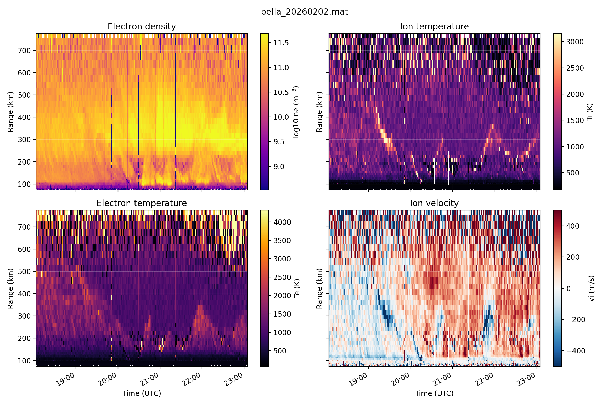
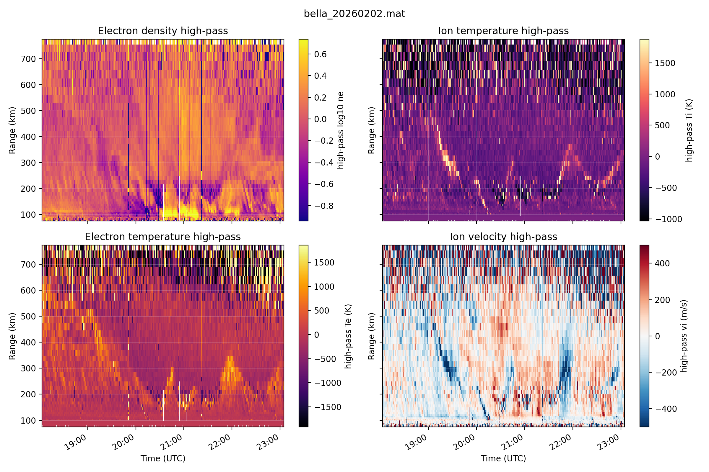
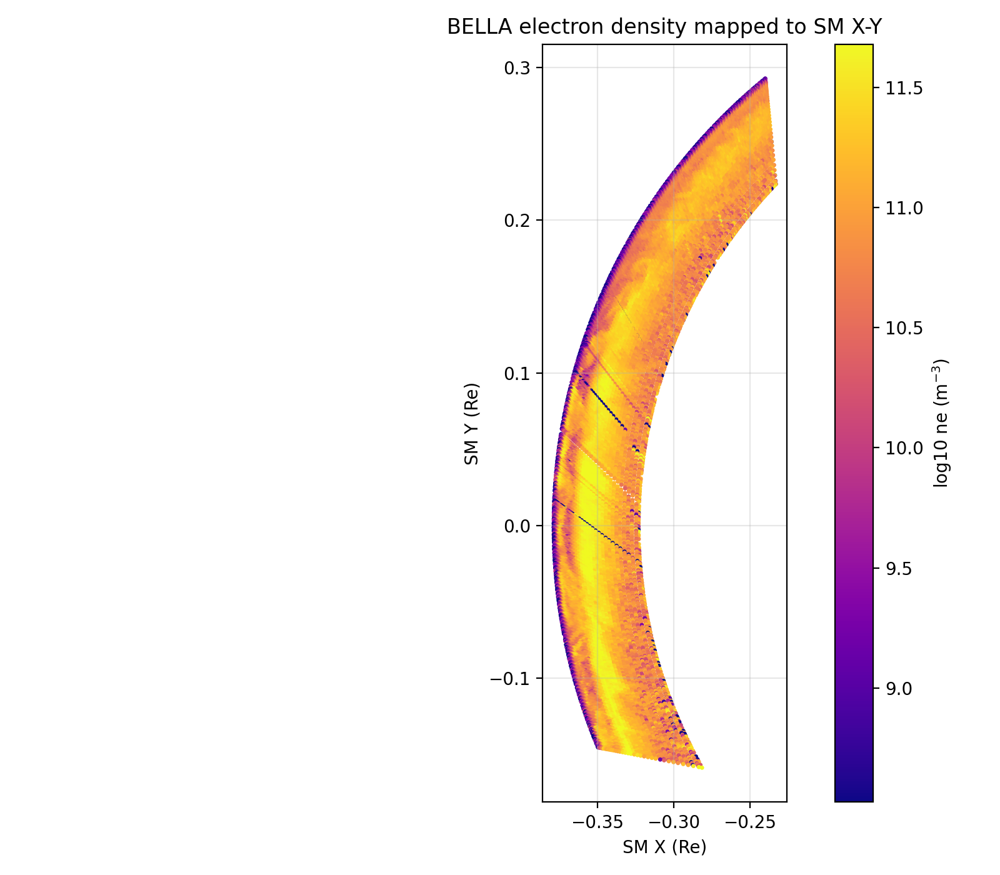
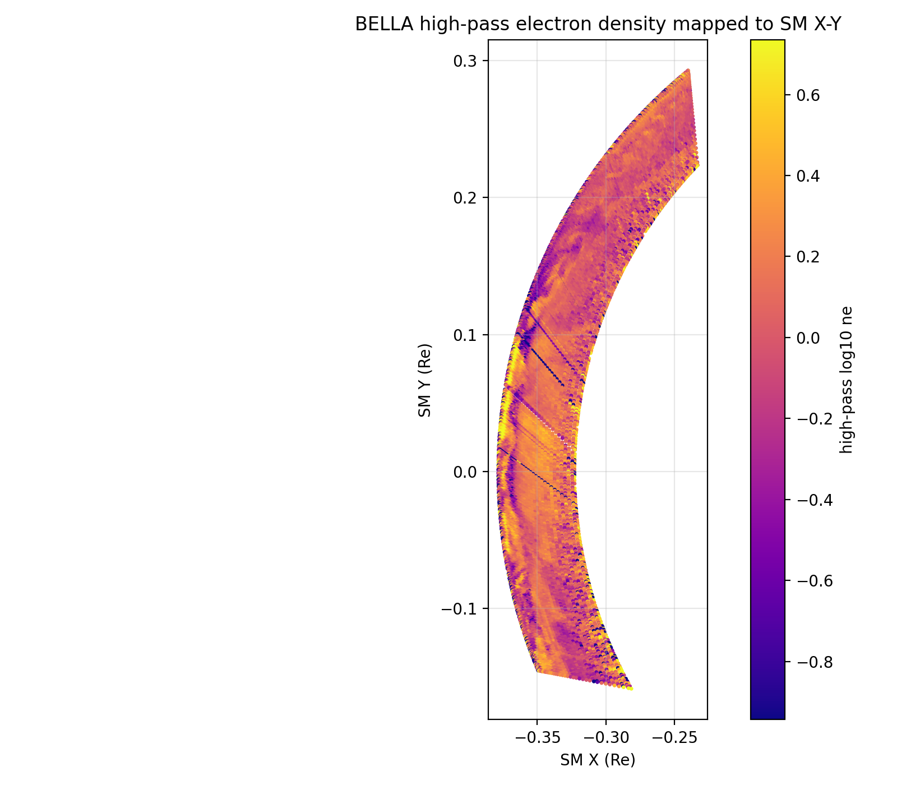
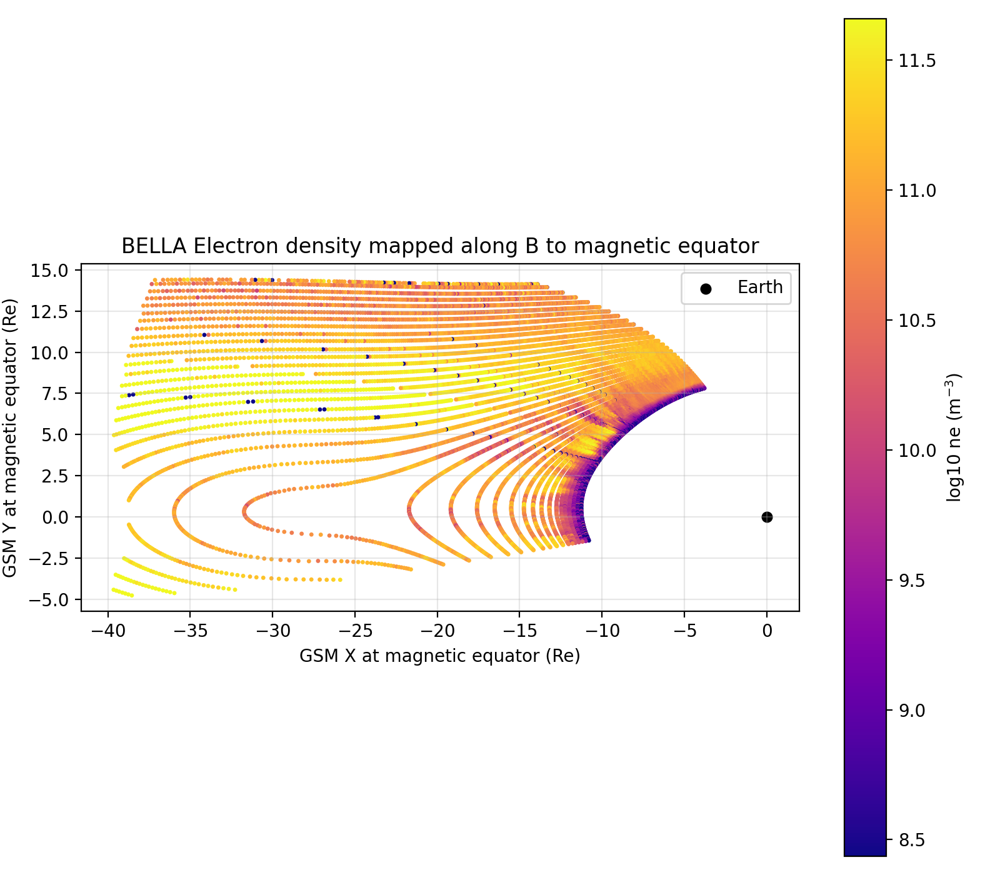
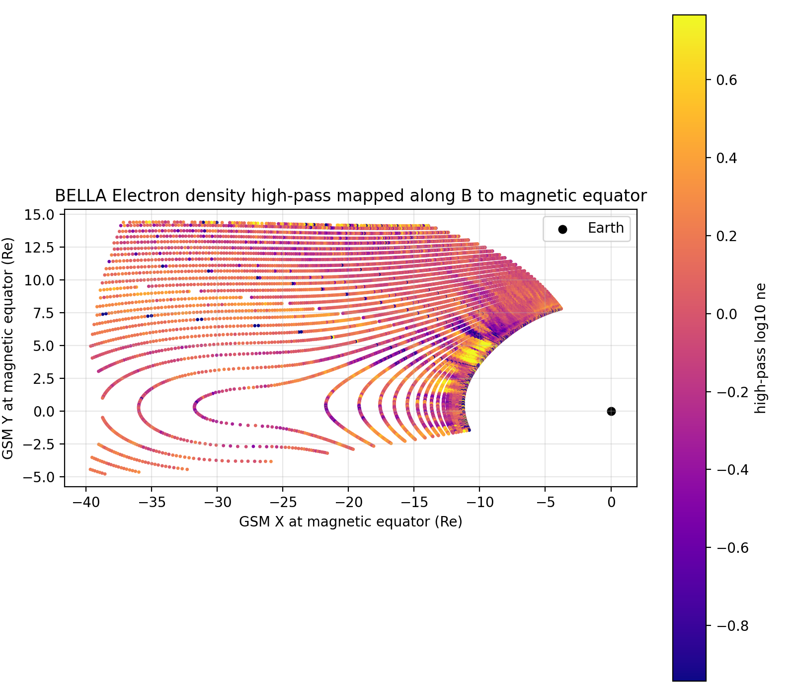
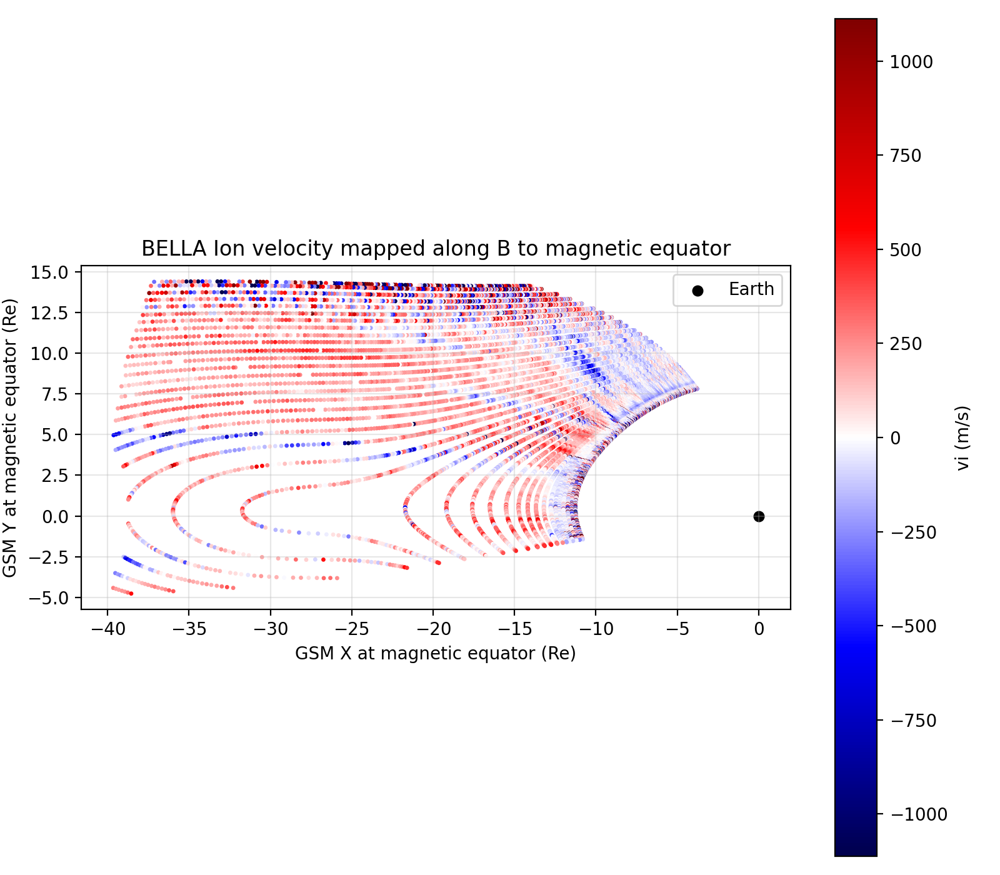
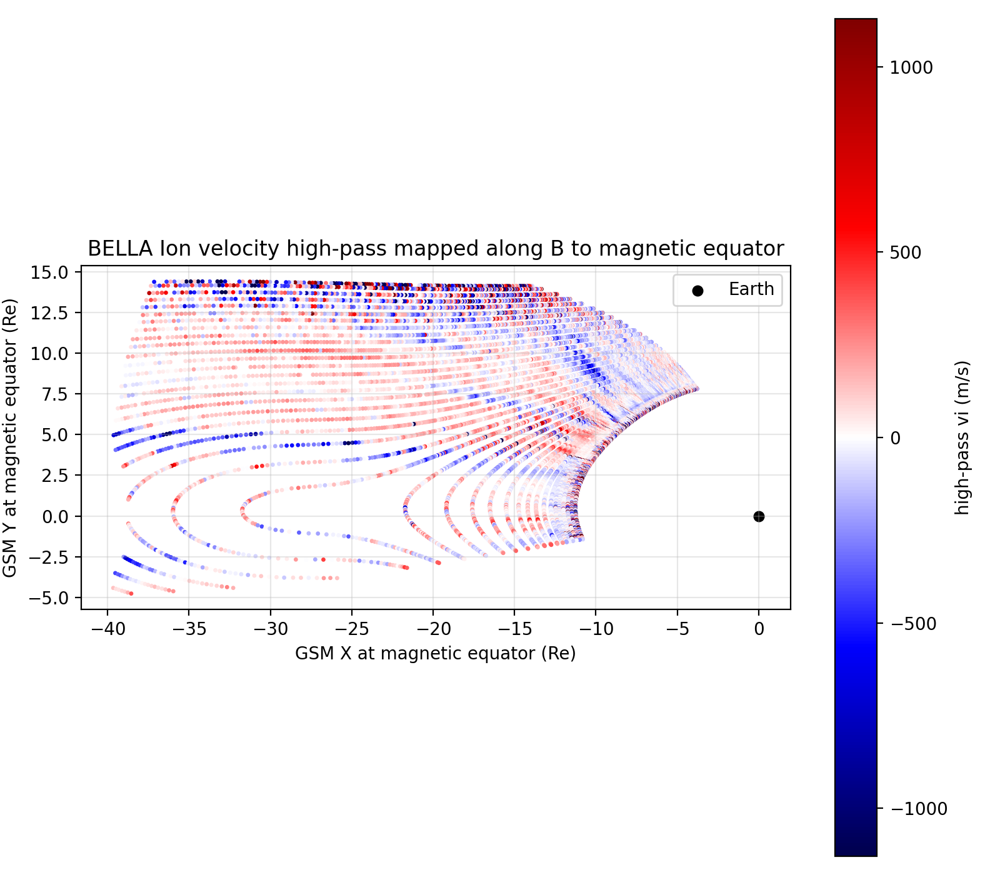

# heimdall2026

Small plotting utilities for the 2026-02-02 BELLA/EISCAT VHF data set.

## Input Data

The examples below use:

```bash
bella_20260202.mat
```

The file contains EISCAT plasma parameters on a range-time grid:
electron density (`ne`), electron temperature (`Te`), ion temperature
(`Ti`), ion velocity (`vi`), range (`h`), time (`t`), azimuth (`az`),
and elevation (`el`).

## Range-Time Plots

Plot the plasma parameters directly as range-time panels:

```bash
python3 plot_bella_range_time.py bella_20260202.mat \
    --output bella_20260202_range_time.png
```

Apply the optional centered high-pass filter before plotting:

```bash
python3 plot_bella_range_time.py bella_20260202.mat \
    --highpass \
    --output bella_20260202_range_time_hp.png
```

The high-pass defaults are a 4 hour symmetric time window and a
100 km symmetric range window. They can be changed with:

```bash
--highpass-time-hours 6 --highpass-range-km 150
```

Example output:



High-pass example:



## Direct SM X-Y Density Map

Map the EISCAT beam points into SpacePy SM coordinates without tracing
along the field line:

```bash
python3 map_ne_sm_xy.py bella_20260202.mat \
    --output bella_20260202_ne_sm_xy.png
```

High-pass version:

```bash
python3 map_ne_sm_xy.py bella_20260202.mat \
    --highpass \
    --output bella_20260202_ne_sm_xy_hp.png
```

Example output:



High-pass example:



## Magnetic-Equator Mapping

Trace EISCAT beam points along the magnetic field to the magnetic
equator and plot the result in GSM coordinates. The default external
field model is T96. If SpacePy OMNI/Qin-Denton data are not available,
the script uses quiet nominal solar-wind parameters unless
`--require-omni` is specified.

```bash
python3 map_ne_magnetic_equator.py bella_20260202.mat \
    --output-prefix bella_20260202_mageq_gsm
```

High-pass version:

```bash
python3 map_ne_magnetic_equator.py bella_20260202.mat \
    --highpass \
    --output-prefix bella_20260202_mageq_gsm_hp
```

These commands produce one plot per plasma parameter:

```text
bella_20260202_mageq_gsm_ne.png
bella_20260202_mageq_gsm_Te.png
bella_20260202_mageq_gsm_Ti.png
bella_20260202_mageq_gsm_vi.png
```

and the corresponding high-pass files:

```text
bella_20260202_mageq_gsm_hp_ne.png
bella_20260202_mageq_gsm_hp_Te.png
bella_20260202_mageq_gsm_hp_Ti.png
bella_20260202_mageq_gsm_hp_vi.png
```

Electron density example:



High-pass electron density example:



Ion velocity example:



High-pass ion velocity example:


